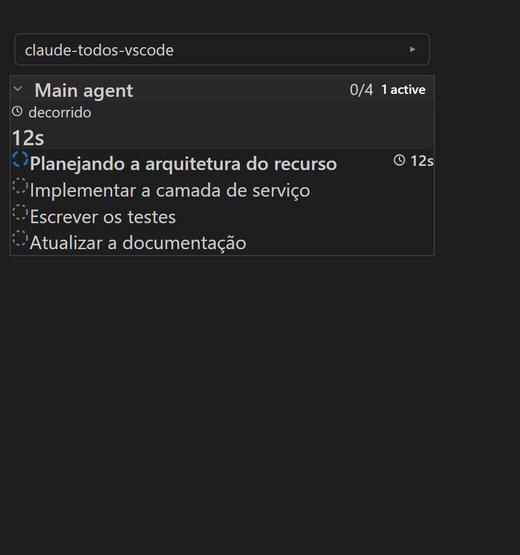
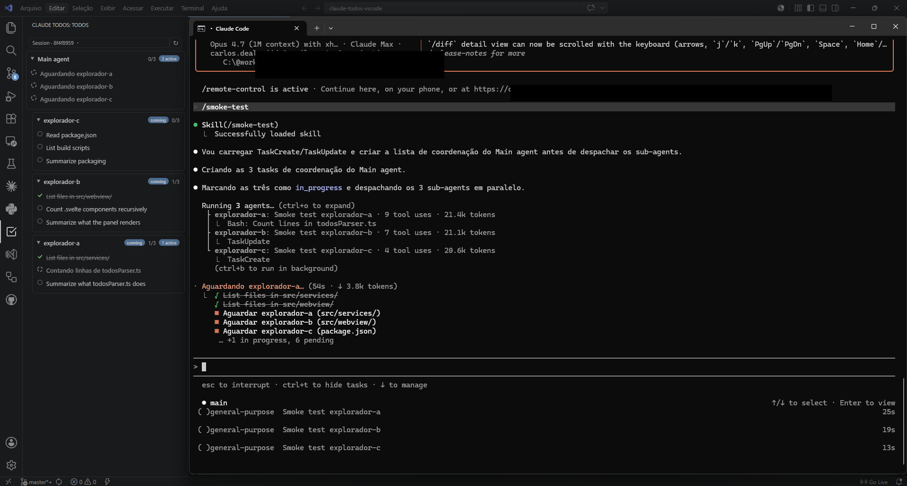

# Claude Todos for VSCode

[Português](README.md) · **English** · [Español](README.es.md)

[](https://marketplace.visualstudio.com/items?itemName=CarlosJunior1992.claude-todos)
[](https://open-vsx.org/extension/CarlosJunior1992/claude-todos)
[](https://github.com/carlosdealmeida/claude-todos-vscode/actions/workflows/ci.yml)
[](LICENSE)

Live view of `TodoWrite` from Claude Code, scoped to the workspace open in the current VSCode window. The panel shows the main agent and its sub-agents side by side. Two VSCode windows in different projects never see each other's todos.



## How it works



The **Claude Todos** panel (Activity Bar, on the left) reads the transcripts Claude Code already writes to disk and shows the main agent and its sub-agents side by side, with each item transitioning `pending → in_progress → completed` in real time as the agent works.

It does not matter **where** `claude` is running: VSCode's integrated terminal, any external terminal (Windows Terminal, iTerm, gnome-terminal), or the Claude Code CLI in a separate window. As long as the session's working directory matches the workspace open in VSCode, the panel reflects it.

## Install

1. Install the extension — from the [VS Code Marketplace](https://marketplace.visualstudio.com/items?itemName=CarlosJunior1992.claude-todos), from [Open VSX](https://open-vsx.org/extension/CarlosJunior1992/claude-todos) (Cursor, Windsurf, VSCodium) or via the `.vsix` file from a [GitHub Release](https://github.com/carlosdealmeida/claude-todos-vscode/releases).
2. On first launch, accept the prompt to install hooks in `~/.claude/settings.json` — the extension adds two: `SessionStart` and `UserPromptSubmit`. Existing hooks are preserved.
3. Open a folder and run `claude` in any terminal. The **Claude Todos** view (Activity Bar) populates as soon as Claude calls `TodoWrite`.

**Sessions that were already running** when you installed the hooks are picked up on the next message you send to them (that's what `UserPromptSubmit` is for). New sessions are tracked immediately.

## Commands

| Command | Default keybinding |
|---|---|
| Claude Todos: Open in Editor | `Ctrl+Alt+T` / `Cmd+Alt+T` |
| Claude Todos: Refresh | — |
| Claude Todos: Install Session Hook | — |

## Settings

| Setting | Default | Effect |
|---|---|---|
| `claudeTodos.claudeDir` | `""` (auto-detect from `os.homedir()`) | Override the `~/.claude` location. |
| `claudeTodos.autoInstallHook` | `true` | Show the first-run prompt asking to install the hooks. |

## Privacy and data flow

This extension is **fully local**. Nothing is sent to a server.

| File | Touched how | Why |
|---|---|---|
| `~/.claude/settings.json` | Read + written (once, with permission) | Adds two hook commands under `hooks.SessionStart` and `hooks.UserPromptSubmit`. Other hooks and settings are preserved. |
| `~/.claude/.vscode-todos-bridge/sessions.json` | Written by the bundled hook script | Records `{cwd, sessionId, terminalPid, startedAt}` so the extension knows which Claude session belongs to which VSCode window. Capped at 200 entries. |
| `~/.claude/projects/{cwd-encoded}/{sessionId}.jsonl` | Read only | Claude Code's own session transcript. The extension scans it from the end to find the latest `TodoWrite` event. |
| `~/.claude/todos/` | Not touched | Legacy location from Claude Code 1.x. Ignored. |

The extension never modifies your transcripts and never deletes anything.

## Requirements

- VSCode 1.85 or newer
- Claude Code 2.x (anything that writes transcripts to `~/.claude/projects/`)
- Node.js 20+ on `PATH` (the hook script is a small Node program)

## Building from source

```bash
git clone <repo-url>
cd claude-todos-vscode
npm install
npm test         # vitest — 51 tests across 6 service suites
npm run build    # esbuild for the extension + hook, vite for the Svelte webview
npx vsce package # produces claude-todos-<version>.vsix
```

To run the extension in a development host: open the folder in VSCode and press F5 (uses `.vscode/launch.json`).

## Known limitations

- Multi-root workspaces use only the first folder.
- The hook script must be reachable from the path stored in `~/.claude/settings.json`. If you delete the extension manually without uninstalling, those hook commands stay behind as no-ops — remove them by hand or reinstall and use `Claude Todos: Install Session Hook` again.

## Contributing

See [CONTRIBUTING.en.md](CONTRIBUTING.en.md) for the smoke-test checklist and the manual test plan.

## License

[MIT](LICENSE)
