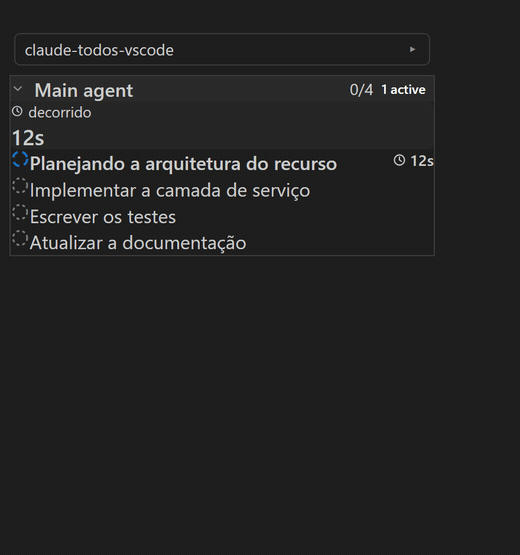
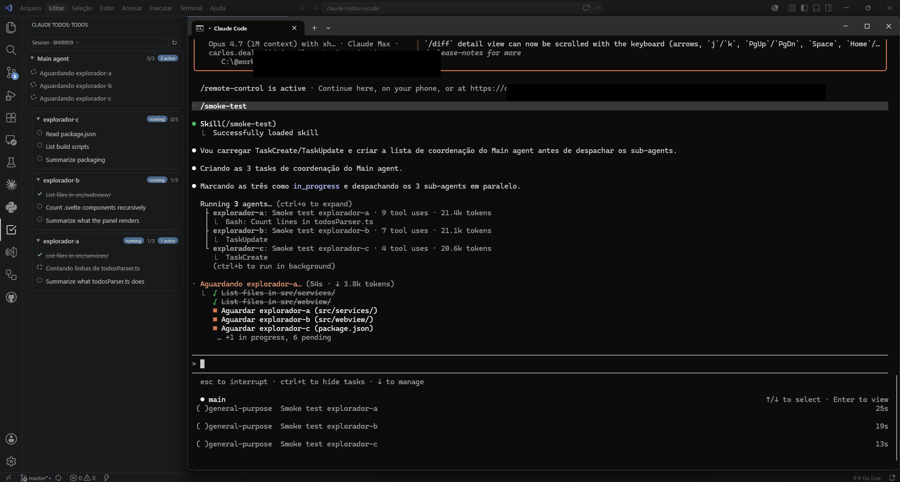

# 適用於 VSCode 和 JetBrains 的 Claude Todos

[Português](README.md) · [English](README.en.md) · [Español](README.es.md) · [简体中文](README.zh-cn.md) · **繁體中文**

> 本翻譯由 AI 生成，尚未經過母語者審校。歡迎提交改進 —— 術語表見 [docs/i18n/glossary-zh.md](docs/i18n/glossary-zh.md)。

[](https://marketplace.visualstudio.com/items?itemName=CarlosJunior1992.claude-todos)
[](https://open-vsx.org/extension/CarlosJunior1992/claude-todos)
[](https://plugins.jetbrains.com/plugin/33074-claude-todos)
[](https://github.com/carlosdealmeida/claude-todos-vscode/actions/workflows/ci.yml)
[](LICENSE)

**為你的 Claude Code 智慧體提供可觀測性** — 任務、智慧體樹、耗時、權杖和快取，即時呈現，且僅限於目前 VSCode 視窗開啟的工作區。一切都是 100% 本機的：不同專案的兩個視窗永遠不會看到彼此的資料。



## 你能獲得什麼

- **即時智慧體樹（「任務指揮中心」）** — 主智慧體 → 子智慧體 → 巢狀智慧體，附帶智慧體類型徽章（Explore、Plan、general-purpose…）、狀態和每個智慧體的權杖數。
- **即時任務** — 每個項目隨著智慧體工作從 `pending → in_progress → completed` 轉變；點擊一個任務會在對話記錄中開啟其最後一次狀態變化所在的行。如果協調者在子智慧體仍在執行時停止更新任務清單，面板會標記出這種滯後。
- **每個任務的耗時** — 每個已完成任務的持續時間、進行中任務的即時計時器，以及剩餘部分的（已標註的）預估。
- **權杖、上下文和快取** — 依模型或依智慧體的表格、附紅綠燈提示的上下文視窗指示器，以及快取效率（重複使用 × 建立 × 新增）。
- **「最近 7 天」儀表板** — 依模型和依智慧體類型彙總的專案使用情況。
- **通知** — 當工作階段閒置等待你時，或所有任務完成時（僅在視窗未取得焦點時）彈出提示。
- **介面支援 5 種語言** — en、pt-br、es、zh-cn 和 zh-tw；跟隨 VS Code 的顯示語言，也可透過設定覆寫。

## 運作原理



**Claude Todos** 面板（位於左側活動列）讀取 Claude Code 已經寫入磁碟的對話記錄 — 無需代理、無需 API — 並在智慧體工作時即時反映所有內容。

`claude` 在**哪裡**執行並不重要：可以是 VSCode 的內建終端機、任何外部終端機（Windows Terminal、iTerm、gnome-terminal），或是在獨立視窗中執行的 Claude Code CLI。只要工作階段的工作目錄與 VSCode 中開啟的工作區一致，面板就會反映出來。

## 安裝

| 編輯器 | 安裝位置 |
|---|---|
| VS Code | [VS Code Marketplace](https://marketplace.visualstudio.com/items?itemName=CarlosJunior1992.claude-todos) |
| Cursor · Windsurf · VSCodium | [Open VSX](https://open-vsx.org/extension/CarlosJunior1992/claude-todos) |
| IntelliJ IDEA · PyCharm · WebStorm · Rider · …（2024.2+） | [JetBrains Marketplace](https://plugins.jetbrains.com/plugin/33074-claude-todos) |
| 任意（離線） | `.vsix`（VS Code）/ `.zip`（JetBrains）— [GitHub Release](https://github.com/carlosdealmeida/claude-todos-vscode/releases) |

> **JetBrains 外掛：** 同一個面板也運行在 JetBrains 系列 IDE 中 — 相同的智慧體樹、
> 耗時、權杖和儀表板，配有原生 toast 通知、點擊任務開啟對話記錄，以及工作階段選擇器。
> 需要 **Node.js 在 PATH 中**（使用 Claude Code 的使用者通常已經具備）。
> 掛鉤是共用的：從一個 IDE 安裝後，另一個也會同時生效。

1. 安裝擴充功能（見上表）。「開始使用 Claude Todos」導覽會出現在編輯器的 *Welcome/Get Started* 頁面，並指引你完成下面的步驟。
2. 首次啟動時，接受安裝掛鉤到 `~/.claude/settings.json` 的提示 — 擴充功能會新增兩個：`SessionStart` 和 `UserPromptSubmit`。既有的掛鉤會被保留。
3. 開啟一個資料夾，在任一終端機中執行 `claude`。一旦工作階段有活動，**Claude Todos** 檢視（活動列）就會開始填入資料。

**安裝掛鉤時已經在執行的工作階段** 會在你向它們傳送下一則訊息時被偵測到（這正是 `UserPromptSubmit` 的作用）。新的工作階段會被立即追蹤。

## 命令

| 命令 | 預設快捷鍵 |
|---|---|
| Claude Todos: Open in Editor | `Ctrl+Alt+T` / `Cmd+Alt+T` |
| Claude Todos: Choose Session | `Ctrl+Alt+S` / `Cmd+Alt+S` |
| Claude Todos: Refresh | — |
| Claude Todos: Install Session Hook | — |

## 設定

| 設定 | 預設值 | 作用 |
|---|---|---|
| `claudeTodos.claudeDir` | `""`（透過 `os.homedir()` 自動偵測） | 覆寫 `~/.claude` 的位置。 |
| `claudeTodos.autoInstallHook` | `true` | 顯示首次執行時詢問是否安裝掛鉤的提示。 |
| `claudeTodos.language` | `auto` | 面板介面語言（`auto` \| `en` \| `pt-br` \| `es` \| `zh-cn` \| `zh-tw`）。 |
| `claudeTodos.notifications` | `true` | 工作階段閒置或完成所有任務時彈出提示（視窗未取得焦點時）。 |
| `claudeTodos.activeFolder` | `""` | 多根工作區：要追蹤的工作區資料夾；留空 = 跟隨最活躍的工作階段。 |

## 隱私與資料流

此擴充功能**完全在本機執行**。不會向任何伺服器傳送任何內容。

| 檔案 | 存取方式 | 原因 |
|---|---|---|
| `~/.claude/settings.json` | 讀取 + 寫入（僅一次，需授權） | 在 `hooks.SessionStart` 和 `hooks.UserPromptSubmit` 下新增兩個掛鉤命令。其他掛鉤和設定會被保留。 |
| `~/.claude/.vscode-todos-bridge/sessions.json` | 由內建的掛鉤指令碼寫入 | 記錄 `{cwd, sessionId, terminalPid, startedAt}`，讓擴充功能知道哪個 Claude 工作階段屬於哪個 VSCode 視窗。最多保留 200 筆記錄。 |
| `~/.claude/projects/{cwd-encoded}/…` | 唯讀 | 由 Claude Code 自身寫入的工作階段和子智慧體對話記錄（`.jsonl` + `.meta.json`）— 任務、樹狀結構、耗時和權杖資料的來源。 |
| `~/.claude/todos/` | 不會被存取 | Claude Code 1.x 的舊版位置，已被忽略。 |

此擴充功能不會修改你的對話記錄，也不會刪除任何內容。

## 環境需求

- VSCode 1.85 或更新版本
- Claude Code 2.x（任何會將對話記錄寫入 `~/.claude/projects/` 的版本）
- Node.js 20+ 且位於 `PATH` 中（掛鉤指令碼是一個小型 Node 程式）

## 從原始碼建置

```bash
git clone <repo-url>
cd claude-todos-vscode
npm install
npm test         # vitest
npm run build    # esbuild for the extension + hook, vite for the Svelte webview
npx vsce package # produces claude-todos-<version>.vsix
```

要在開發主機中執行擴充功能：在 VSCode 中開啟該資料夾並按 F5（使用 `.vscode/launch.json`）。

## 已知限制

- 掛鉤指令碼必須始終可以透過 `~/.claude/settings.json` 中儲存的路徑存取。如果你手動刪除擴充功能而未解除安裝它，那些掛鉤命令會變成空操作（no-op）— 需要手動移除它們，或是重新安裝並再次執行 `Claude Todos: Install Session Hook`。

## 貢獻

參見 [CONTRIBUTING.md](CONTRIBUTING.md) 取得冒煙測試（smoke-test）清單和手動測試計畫。

## 授權條款

[MIT](LICENSE)
